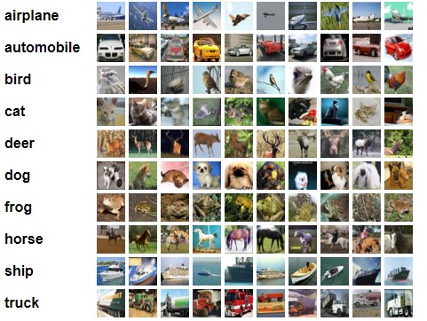
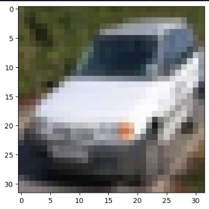

# CIFAR 10 com Redes Neurais Convolucionais

Neste trabalho desenvolveremos um projeto de Aprendizado de Máquina Supervisionado utilizando Redes Neurais Artificiais como modelo de referência.

## Objetivos

São os objetivos desse trabalho as seguintes etapas:

1. Coleta e preparação de dados;

2. Análise exploratória da base de dados;

3. Determinação da tarefa de Aprendizado de Máquina;

4. Determinação da abordagem de validação cruzada a ser adotada e das métricas de desempenho a serem aferidas, com justificativa que corroborem as escolhas efetuadas;

5. Elaboração de uma grade de busca de modelos, parâmetros e hiperparâmetros nas Redes Neurais Artificiais;

6. Treinamento e teste dos modelos;

7. Análise qualitativa e quantitativa de desempenho dos modelos avaliados.

## Análise exploratória 

A base utilizada para o desenvolvimento do projeto foi o **CIFAR 10** que consiste num dataset com 60 mil imagens de dimensões 32x32 distribuídos em 10 classes.

Por padrão o dataset já está dividido da seguinte forma: 50 mil imagens de treinamento e 10 mil imagens para teste

A seguir uma visão geral do dataset:

Foi feita uma leitura no código Python do dataset e esta é uma imagem que pode ser visualizada:

